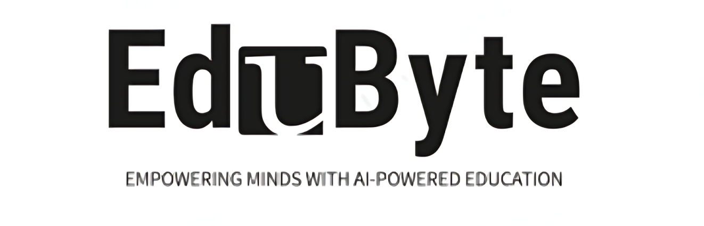
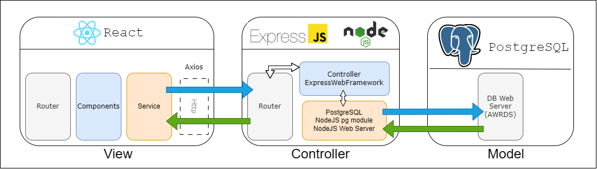

# Software Development Project **`EduByte`**

# **Project Overview**
**"EduByte,"** an e-learning platform designed to enhance computer science education. Key functionalities of EduByte include a broad spectrum of computer science courses, interactive learning modules through video lectures and blogs, a simple yet effective course recommendation system, automated assessments with instant feedback, and a comprehensive progress tracker. Additionally, the platform fosters community engagement through interactive forums and is accessible to all learners. We believe these features collectively make EduByte a valuable tool in computer science education.

# Project Team
- 1905075 - Nahida Marzan
- 1905086 - Sushmita Paul
- 1905096 - Apurbo Banik Turjo

# API Documentation: 
Site's Endpoints Documentation: [API DOC](https://documenter.getpostman.com/view/32129219/2s9YsGhD2R)

# Project Architecture - **`Model View Controller`**

# **Tech Stack & Tools**
- Tech Stack: **`PERN`**
- Frontend : `React`, `HTML`, `CSS`, `Bootstrap`
- Backend : `ExpressJS Framework`, `NodeJS`
- Database : `PostgreSQL`
- Tools :
  - `DataGrip` - Database Management
  - `Postman` - API Documentation, Debugging, API Testing
- Hosting Service: `Amazon Web Service (AWS)`, `Amazon Web Relational Database Service (AWRDS) (PostgreSQL server)`
